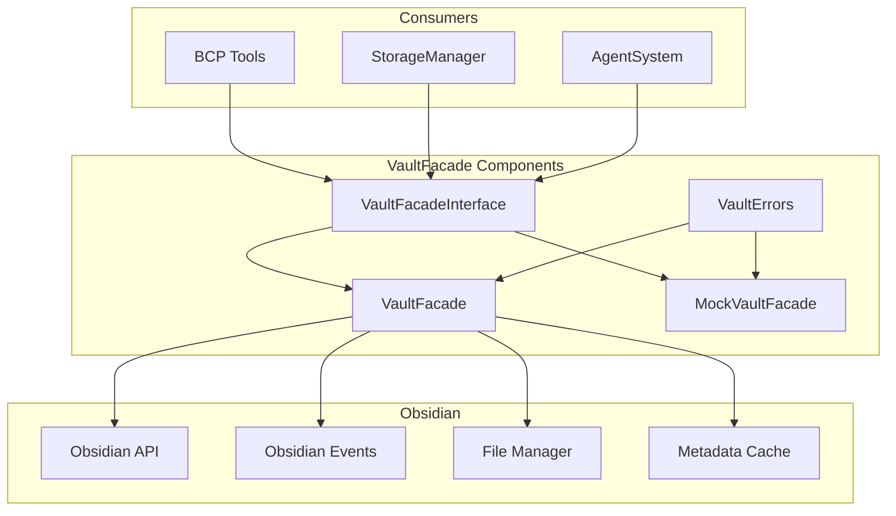

# System Patterns: Chatsidian

*This file documents the system architecture, key technical decisions, design patterns in use, and component relationships, based on initial project documentation.*

## High-Level Architecture

Chatsidian follows a modular architecture composed of three main layers:

1.  **UI Components**: Responsible for rendering the chat interface within Obsidian (e.g., `ChatView`, `MessageList`, `InputArea`).
2.  **Core Components**: Manage the plugin's lifecycle, state, and core functionalities (e.g., `PluginCore`, `SettingsManager`, `StorageManager`, `EventBus`, `VaultFacade`).
3.  **MCP Components**: Handle communication with AI models via MCP and manage vault interactions through agents (e.g., `MCPClient`, `BCPRegistry`, `ToolManager`, `AgentSystem`).

These layers interact with the Obsidian API, a dedicated Storage Layer within the vault, and external AI Providers.

```mermaid
graph TD
    subgraph Chatsidian Plugin
        UI[UI Components]
        Core[Core Components]
        MCP[MCP Components]
        VF[VaultFacade]
    end

    subgraph External Systems
        Obsidian[Obsidian API]
        Storage[Storage Layer (Vault)]
        AI[AI Providers (via MCP)]
    end

    UI --> Obsidian
    Core --> Obsidian
    Core --> Storage
    MCP --> Storage
    MCP --> AI
    MCP --> VF
    VF --> Obsidian

    UI -- Events --> Core
    Core -- Events --> UI
    Core -- Events --> MCP
    MCP -- Events --> Core
    MCP -- Actions --> VF
```

## Key Architectural Decisions

1.  **Native Chat UI**: Implement the chat interface using native Obsidian views (`ItemView`) rather than web workers or iframes for better integration and performance.
2.  **Agent System Reuse**: Leverage the agent architecture concepts from the Claudesidian project for performing vault operations via MCP/BCPs.
3.  **Vault-Based Persistence**: Store conversation history and settings directly within the user's Obsidian vault (likely using JSON files or a dedicated data file).
4.  **Direct MCP Integration**: Implement direct API integration with AI providers supporting the Model Context Protocol.
5.  **Modular Component Structure**: Design the plugin with clear separation of concerns between UI, core logic, and MCP/agent functionalities.
6.  **VaultFacade Abstraction**: Implement a dedicated abstraction layer for all Obsidian vault operations to improve testability, maintainability, and provide a consistent interface for the rest of the application.

## Core Architectural Patterns

-   **Event-Based Communication**: Components communicate primarily through an `EventBus`, similar to Obsidian's internal mechanisms, promoting loose coupling.
-   **Adapter Pattern**: Abstract interactions with different AI providers behind a common `ProviderAdapter` interface.
-   **Repository Pattern (Implicit via StorageManager)**: Abstract data persistence (conversations, settings) through a dedicated `StorageManager` service.
-   **Command Pattern (via BCP Tools)**: Encapsulate vault operations as distinct tools within Bounded Context Packs.
-   **Dependency Injection (Implicit via Plugin Lifecycle)**: Core components are instantiated and wired together during the plugin's `onload` phase.
-   **Bounded Context (via BCPs)**: Organize AI tools/capabilities into domain-specific Bounded Context Packs (BCPs) like `NoteManager`, `FolderManager`, `VaultLibrarian`, `PaletteCommander`.
-   **Facade Pattern (via VaultFacade)**: Provide a simplified, consistent interface for all Obsidian vault operations, hiding the complexity of the underlying API.
-   **Component Pattern (via Obsidian's Component class)**: Leverage Obsidian's Component pattern for proper lifecycle management, ensuring resources are properly cleaned up when the plugin is unloaded.
-   **Wrapper Pattern (for Testing)**: Use wrapper classes (e.g., `BCPRegistryForTests`) that reimplements functionality specifically for testing, avoiding issues with TypeScript's access modifiers at runtime.

## Component Relationships & Data Flow

-   **User Input**: `ChatView` captures user input -> dispatches event via `EventBus`.
-   **AI Request**: `MCPClient` listens for message events -> formats request -> uses `ProviderAdapter` to send to AI.
-   **Tool Calls**: AI response may contain tool calls -> `MCPClient` parses -> `ToolManager` routes to appropriate BCP tool handler.
-   **Vault Actions**: BCP tool handlers use `VaultFacade` to interact with the vault, providing a consistent interface and error handling.
-   **Tool Response**: Tool results sent back to AI via `MCPClient`/`ProviderAdapter`.
-   **Final Response**: AI's final response -> `MCPClient` processes -> dispatches event via `EventBus` -> `ChatView` displays the message.
-   **Persistence**: `StorageManager` handles saving/loading conversations and settings to/from the vault, using `VaultFacade` for file operations.
-   **Settings**: `SettingsManager` loads/saves settings and notifies components of changes via `EventBus`.

## Bounded Context Packs (BCPs)

BCPs group related tools for interacting with specific domains within the vault:

-   **NoteManager**: CRUD operations for notes.
-   **FolderManager**: CRUD operations for folders.
-   **VaultLibrarian**: Search and query operations.
-   **PaletteCommander**: Listing and executing Obsidian commands.

## VaultFacade Abstraction Layer

The VaultFacade provides a simplified, consistent interface for all Obsidian vault operations, improving testability, maintainability, and performance of Chatsidian.



### VaultFacade Design Patterns

-   **Interface Segregation**: The `IVaultFacade` interface defines a clear contract for vault operations, allowing for multiple implementations.
-   **Facade Pattern**: Simplifies the complex Obsidian API into a more manageable interface.
-   **Adapter Pattern**: Adapts Obsidian's API to a more consistent, promise-based interface.
-   **Observer Pattern**: Uses Obsidian's Events system to notify consumers of vault changes.
-   **Error Handling Strategy**: Custom error types for different failure scenarios, with consistent error propagation.
-   **Mock Object Pattern**: `MockVaultFacade` provides an in-memory implementation for testing without requiring an actual Obsidian instance.
-   **Component Lifecycle Management**: Extends Obsidian's Component class for proper resource cleanup.

### Key VaultFacade Features

-   **File Operations**: Create, read, update, delete, and rename notes.
-   **Folder Operations**: Create, list, and delete folders.
-   **Search Capabilities**: Content search and tag search.
-   **Frontmatter Management**: Update frontmatter metadata.
-   **Event System**: Events for all vault operations and external changes.
-   **Error Handling**: Custom error types for different failure scenarios.
-   **Path Normalization**: Consistent path handling across the application.
-   **Attachment Management**: Utilities for handling attachments.
